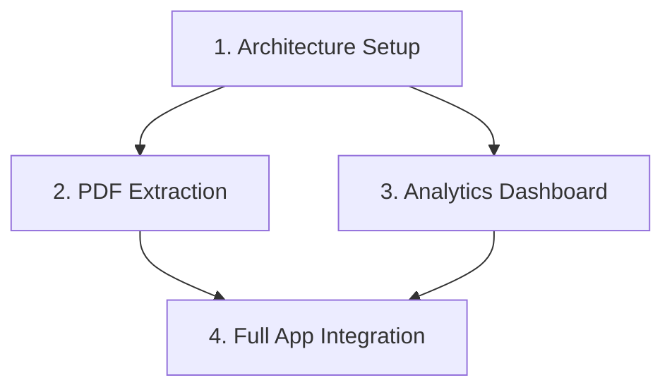

# Professional ML Engineer Exam Prep - Custom Skills

This directory contains comprehensive custom skills for building a production-grade Professional Machine Learning Engineer exam preparation application.

## Available Skills

### 1. **exam-prep-architecture**
Full-stack architecture patterns for exam prep applications.

**Covers:**
- React + TypeScript + Supabase + Vercel stack
- Complete database schema with Row Level Security
- Authentication patterns
- API design with Supabase Edge Functions
- Deployment configuration
- Performance optimization strategies

**Use this skill for:**
- Setting up the project architecture
- Designing the database schema
- Implementing authentication
- Deploying to Vercel

📄 [View Skill](./exam-prep-architecture/SKILL.md)

---

### 2. **pdf-question-extraction**
Patterns for extracting and structuring questions from PDF documents.

**Covers:**
- PDF parsing strategies (manual, automated, LLM-based)
- Structured JSON/SQL data formats
- Validation and quality checking
- Topic tagging and categorization
- Import scripts for Supabase
- Multiple extraction approaches with code examples

**Use this skill for:**
- Extracting questions from your 2 exam PDFs
- Validating extracted data
- Importing questions into the database
- Auto-tagging questions with topics

📄 [View Skill](./pdf-question-extraction/SKILL.md)

---

### 3. **analytics-dashboard**
Comprehensive analytics and progress tracking implementation.

**Covers:**
- Performance metrics and KPIs
- Progress visualization with Recharts
- Study plan generation algorithms
- Weak area identification
- Spaced repetition patterns
- Exam readiness scoring
- Database queries and optimizations

**Use this skill for:**
- Building the analytics dashboard
- Implementing progress tracking
- Creating personalized study plans
- Identifying weak topics
- Predicting exam readiness

📄 [View Skill](./analytics-dashboard/SKILL.md)

---

## How to Use These Skills

### Autonomous Development Approach

These skills are designed to be used as comprehensive reference guides for building the exam prep app. Each skill is self-contained with:

- ✅ **Complete code examples** ready to copy/adapt
- ✅ **Database schemas and queries**
- ✅ **TypeScript types and interfaces**
- ✅ **React components and hooks**
- ✅ **Testing patterns**
- ✅ **Common pitfalls and solutions**
- ✅ **Integration checklists**

### Recommended Build Order



1. **Phase 1: Foundation** (Use: exam-prep-architecture)
   - Set up Supabase project
   - Create database schema
   - Initialize React + TypeScript + Vite project
   - Configure authentication
   - Deploy to Vercel

2. **Phase 2: Content** (Use: pdf-question-extraction)
   - Extract questions from your 2 PDFs
   - Validate and structure data
   - Import into Supabase
   - Verify data integrity

3. **Phase 3: Features** (Use: exam-prep-architecture + analytics-dashboard)
   - Build question practice interface
   - Implement analytics dashboard
   - Create study plan generator
   - Add weak area detection

4. **Phase 4: Polish**
   - Add tests
   - Optimize performance
   - Improve UX/UI
   - Final deployment

### Quick Start Commands (Suggested)

```bash
# Initialize project
npm create vite@latest ml-exam-prep -- --template react-ts
cd ml-exam-prep

# Install dependencies
npm install @supabase/supabase-js @tanstack/react-query
npm install recharts zustand
npm install -D @types/node

# Install UI library
npx shadcn-ui@latest init

# Set up Supabase
# (Create project at supabase.com, then add .env.local)

# Start development
npm run dev
```

## Tech Stack Summary

| Layer | Technology | Purpose |
|-------|-----------|---------|
| Frontend | React 18 + TypeScript | UI Framework |
| Build Tool | Vite | Fast development |
| Styling | TailwindCSS + shadcn/ui | UI Components |
| State | Zustand / React Query | State Management |
| Backend | Supabase | Database + Auth + API |
| Database | PostgreSQL | Data Storage |
| Deployment | Vercel | Hosting |
| Charts | Recharts | Analytics Visualization |

## Project Context

**Goal:** Build a comprehensive exam preparation app for the Google Cloud Professional Machine Learning Engineer certification.

**Source Material:**
- `Professional Machine Learning Engineer Sample Questions.pdf`
- `professional_machine_learning_engineer_exam_guide_english.pdf`

**Key Features:**
1. Question bank with filtering by topic/difficulty
2. Practice mode with immediate feedback
3. Timed exam simulation
4. Progress tracking and analytics
5. Personalized study plans
6. Weak area identification
7. Spaced repetition

## Development Philosophy

These skills follow **best practices**:
- ✅ Type-safe TypeScript throughout
- ✅ Proper error handling
- ✅ Security-first (RLS policies)
- ✅ Performance optimized
- ✅ Accessible UI components
- ✅ Responsive design
- ✅ Test coverage
- ✅ Clean code architecture

## Next Steps

Ready to build? Here's your action plan:

1. ✅ **Skills Created** ← You are here
2. 📋 Review each skill document
3. 🏗️ Set up Supabase project
4. 💻 Initialize React project
5. 📊 Implement database schema
6. 📝 Extract PDF questions
7. 🎨 Build UI components
8. 📈 Add analytics dashboard
9. 🧪 Write tests
10. 🚀 Deploy to Vercel

---

**Created:** 2025-11-15
**Purpose:** Comprehensive skills for autonomous ML exam prep app development
**Status:** Ready for implementation
